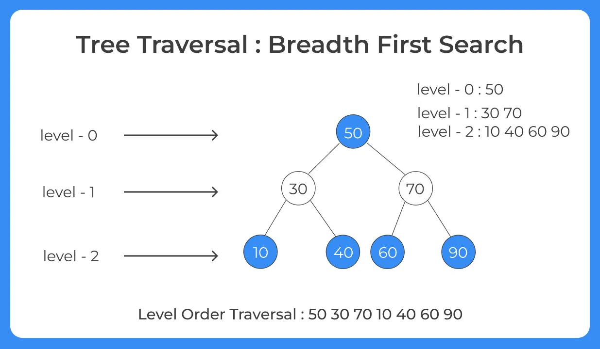
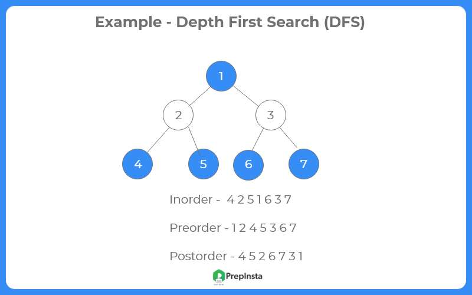

# Binary-Search-Tree
-Binary Search Tree(BST) represents a group of data items that are turned into a tree full of nodes. Each left node is ''lower'' than each right node. The tree's base is a ''root node'' and every node with no children is called a ''leaf node'' just like a real tree. It can be traversed with breadth-first and depth-first. Every line, or layer is called a ''level'' and it goes from the root to the leaves.
A binary search tree can be tricky, since if there are a lot of nodes the search performance can decrease easily.
That is how it becomes unbalanced. The left and right properties are helpful for that.

 (source: https://prepinsta.com/data-structures/tree-traversal-breadth-first-search-bfs/)
 (source: https://prepinsta.com/data-structures/tree-traversal-depth-first-search-dfs/)